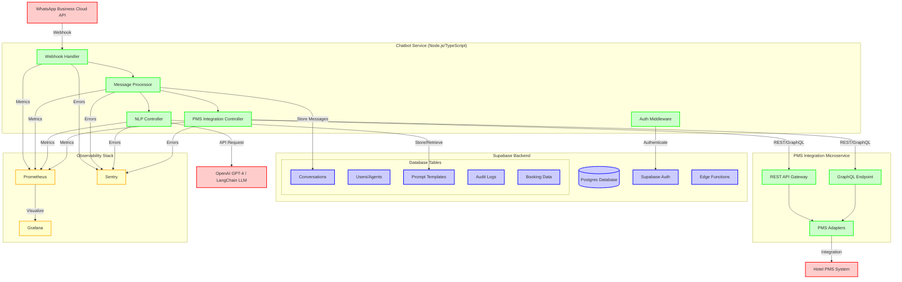
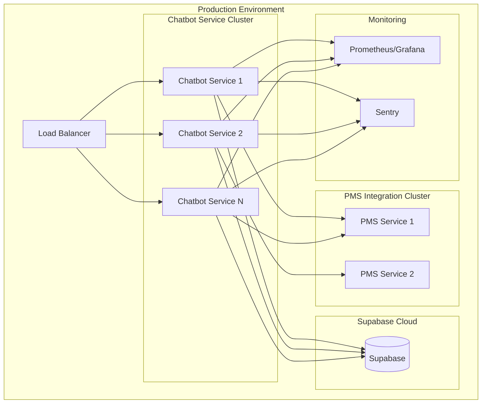

# Hotel Voice Bot System Architecture

## Architecture Diagram

## Component Details

### 1. WhatsApp Business Cloud API Integration

- **Webhook Handler**: Receives incoming messages from WhatsApp
- **Message Processor**: Processes and routes messages
- **Security**: Webhook verification and rate limiting

### 2. Chatbot Service (Node.js/TypeScript)

- **Framework**: NestJS for structured, scalable architecture
- **Features**:
  - Webhook handling for WhatsApp messages
  - Message processing and routing
  - NLP integration controller
  - PMS integration controller
  - Authentication middleware

### 3. Supabase Backend

- **Database**: PostgreSQL for persistent data storage
- **Authentication**: Supabase Auth for agent/operator login
- **Edge Functions**: For serverless processing if needed
- **Tables**:
  - Conversations: Chat history and context
  - Users/Agents: Authentication and authorization
  - Prompt Templates: NLP prompts and responses
  - Audit Logs: Security and compliance tracking
  - Booking Data: Hotel reservation information

### 4. NLP Layer

- **Primary**: OpenAI GPT-4 for advanced language understanding
- **Alternative**: Open-source LLM via LangChain
- **Prompt Management**: Templates stored in Supabase
- **Context**: Conversation history and hotel-specific knowledge

### 5. Hotel PMS Integration Microservice

- **REST API**: Standard HTTP endpoints
- **GraphQL**: For flexible data querying
- **Adapters**: Support multiple PMS systems
- **Features**: Booking management, room availability, guest services

### 6. Observability Stack

- **Prometheus**: Metrics collection and storage
- **Grafana**: Visualization and dashboards
- **Sentry**: Error tracking and performance monitoring

## Security Considerations

### PCI/PII Compliance

- **Data Encryption**: All sensitive data encrypted at rest and in transit
- **Access Control**: Role-based access via Supabase Auth
- **Audit Logging**: All operations logged for compliance
- **Token Security**: Secure token exchange between services

### Data Residency

- **Supabase**: Configure for specific geographic regions
- **OpenAI**: Review data processing agreements
- **Monitoring**: Track data flow across regions

## Scalability Design

### Horizontal Scaling

- **Stateless Services**: All services designed to be stateless
- **Load Balancing**: Multiple instances behind load balancer
- **Database Scaling**: Supabase handles automatic scaling
- **Caching**: Redis for frequently accessed data

### Performance Optimization

- **Database Indexing**: Optimized queries for conversations and bookings
- **Connection Pooling**: Efficient database connections
- **Async Processing**: Non-blocking operations
- **Rate Limiting**: Prevent abuse and ensure fair usage

## Deployment Architecture

